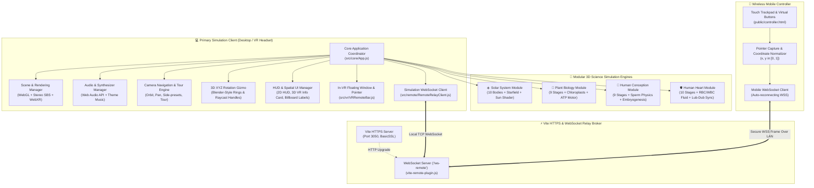

# 🏛️ Science Explorer 3D: Pin-to-Pin System Architecture Blueprint

> **System Blueprint & Technical Specification**  
> Comprehensive documentation of the architecture, subsystems, mathematical transformations, GLSL shaders, network protocols, and design patterns powering **Science Explorer 3D**.

---

## 1. Executive Architecture & Technology Stack

```text
┌──────────────────────────────────────────────────────────────────────────────┐
│                            SCIENCE EXPLORER 3D                               │
│        Interactive WebGL / WebXR Multi-Topic Scientific Simulation           │
└──────────────────────────────────────────────────────────────────────────────┘
                                       │
     ┌─────────────────────────────────┼────────────────────────────────┐
     ▼                                 ▼                                ▼
┌──────────────────────┐   ┌──────────────────────┐   ┌──────────────────────┐
│  Three.js WebGL/XR   │   │  Node.js + Vite WSS  │   │   Mobile Controller  │
│  • WebGLRenderer     │   │  • Vite Dev Server   │   │   • Pointer Events   │
│  • Custom Shaders    │   │  • WebSocket Relay   │   │   • Normalized Math  │
│  • WebXR & Dual SBS  │   │  • BasicSSL (HTTPS)  │   │   • Glassmorphism UI │
└──────────────────────┘   └──────────────────────┘   └──────────────────────┘
```

### Core Technologies:
- **Rendering Engine:** [Three.js](https://threejs.org/) (`^0.170.0`) utilizing WebGL 2.0 and WebXR Device API.
- **Custom Shaders:** GLSL (Vertex and Fragment) for procedural noise, solar corona plasma convection, atmospheric Rayleigh scattering, and fluid cellular membrane rendering.
- **Build System & Dev Server:** [Vite](https://vitejs.dev/) (`^5.4.10`) with `@vitejs/plugin-basic-ssl` for local HTTPS.
- **Real-Time Communication:** Node.js [`ws`](https://github.com/websockets/ws) (`^8.21.3`) embedded directly into Vite's HTTP server via `noServer` upgrade interception.
- **Audio Engine:** Web Audio API with procedural hemodynamic pulse synthesis, directional audio spatialization, and music streaming.

---

## 2. Subsystem Topology & Block Diagram



---

## 3. Core Engine Lifecycle (`src/core/`)

### 3.1. `App.js` — The Master Controller
`App.js` orchestrates all subsystems, owns the main animation loop, initializes input systems, and coordinates module switching.
- **Clock & Delta Time:** A `THREE.Clock` generates frame deltas ($\Delta t \le 0.1s$) passed to every animated model and controller.
- **Render Loop Sequencing:**
  1. `navigationController.update(delta)` — updates orbital inertia and camera positions.
  2. `tourController.update(delta * speed)` — advances the 10-stage cinematic tour.
  3. `vrRemoteBar.update(delta)` — animates the in-VR floating window and reticle.
  4. `gizmo3D.update(delta)` — tracks the selected object and updates ring matrices.
  5. `activeEnvironment.update(delta)` — updates background particles, stars, or vascular blood streams.
  6. `stageModels.forEach(m => m.update(delta))` — animates biological and planetary geometry.
  7. `billboardLabels.update(camera)` — computes 2D camera-facing orientations for floating tags.
  8. `audioManager.updateHeartbeat(delta)` — triggers synchronized cardiac acoustics for Heart and Conception modules.
  9. `sceneManager.render()` — renders the frame via standard camera, Stereo camera, or WebXR frame.

### 3.2. `SceneManager.js` — Rendering & Stereo VR
- **Dual-Screen SBS VR:** Implements Google Cardboard / VR Box split-screen stereoscopic rendering using `THREE.StereoCamera` with configurable inter-pupillary distance (IPD: default $0.064m$).
- **Orientation Auto-Compensation:** Reads `screen.orientation.angle` to support both left and right landscape insertion.
- **WebXR 6-DOF:** Integrates native WebXR immersive VR sessions via `navigator.xr.requestSession('immersive-vr')`.

### 3.3. `AudioManager.js` — Procedural & Spatial Sound
- **Stranger Things Theme:** Background streaming audio with automatic crossfading and looping.
- **Hemodynamic Heartbeat Synthesizer:** Real-time Web Audio oscillator and noise generator producing realistic acoustic *Lub-Dub* ($S_1$ and $S_2$) heart sounds synchronized with the model's BPM setting.

---

## 4. The Four Science Simulation Engines (`src/models/`)

### ☀️ Module 1: The Solar System (`solar`)
- **Procedural Sun Shader:** Custom GLSL Simplex Fractal Brownian Motion (FBM) with 4 octaves running in fragment shader to simulate turbulent solar granulation, convection cells, and high-energy coronal filaments.
- **Atmospheric Rayleigh Scattering:** Earth features a dual-shell geometry; the outer shell renders a translucent Fresnel shader simulating blue-light atmospheric scattering.
- **Orbital Mechanics:** Each planet orbits the Sun with physically scaled semi-major axes and axial tilts (e.g., Saturn at $26.7^\circ$, Uranus at $97.8^\circ$).

### 🌿 Module 2: Plant Biology & Photosynthesis (`photosynthesis`)
- **Photon Transport:** Instanced particle streams representing light quanta emitted from the Sun entering stomata.
- **Thylakoid Membrane Complex:** High-detail 3D representations of PSII, Plastoquinone ($PQ$), Cytochrome $b_6f$, Plastocyanin ($PC$), and Photosystem I ($PSI$).
- **Rotary ATP Synthase:** Multi-part mechanical model where the $F_0$ c-ring rotor physically spins based on the simulated proton-motive force ($\Delta \text{pH}$ slider).

### 👶 Module 3: Human Conception & Embryogenesis (`reproduction`)
- **Flagellar Wave Physics:** 300 million spermatozoa simulated via instanced meshes with a sinusoidal wave equation driving tail beat frequency:
  $$y(t, x) = A \cdot \sin(\omega t - k x)$$
- **Cortical Reaction & Zinc Spark:** Radial particle explosion triggering bioluminescent flash upon sperm-egg membrane fusion.
- **Embryological Morphogenesis:** Progressive stages transitioning from 2-cell cleavage, 16-cell morula, blastocyst, gastrula, primitive heart tube pulsation, to full-term infant.

### 🫀 Module 4: Human Heart & Cardiovascular System (`heart`)
- **10 Anatomical Stage Models:**
  1. `VenaCavaModel`: Deoxygenated return via Superior & Inferior Vena Cava.
  2. `RightAtriumTricuspidModel`: Pectinate muscle, SA node location, tricuspid valve.
  3. `RightVentricleModel`: Trabeculae carneae and papillary muscles.
  4. `PulmonaryArteryModel`: Semilunar pulmonary valve trunk bifurcating to lungs.
  5. `AlveolarCapillaryGasExchangeModel`: Microscopic alveolus encircled by capillaries; RBCs change color from venous dark purple (`#4c1d95`) to oxygenated bright red (`#ef4444`).
  6. `PulmonaryVeinsLeftAtriumModel`: Four oxygenated pulmonary veins entering left atrium.
  7. `MitralValveModel`: Dual-leaflet bicuspid valve anchored by fibrous chordae tendineae.
  8. `LeftVentricleMyocardiumModel`: Extra-thick muscular wall generating systemic pressure.
  9. `AorticArchModel`: Systemic trunk distributing blood via brachiocephalic, carotid, and subclavian arteries.
  10. `CompleteBeatingHeartModel`: Fully articulated 4-chamber anatomical organ with dynamic ventricular contraction, atrial pre-load, and valve flap kinematics.
- **Living Cardiovascular Environment (`LivingHeartCardiovascularEnvironment.js`):**
  A 3D vascular lumen tunnel containing **1,200 red blood cells (erythrocytes)** and **80 white blood cells (leukocytes)** driven by a turbulent fluid vector field pulsing in sync with the heart rate.

---

## 5. Interaction & Navigation Subsystem (`src/interaction/`)

### 5.1. `NavigationController.js`
- **Spherical Camera Coordinates:** Camera position is governed by spherical coordinates $(\rho, \theta, \phi)$ centered around target position $\vec{T}$:
  $$\vec{C} = \vec{T} + \begin{pmatrix} \rho \sin\phi \sin\theta \\ \rho \cos\phi \\ \rho \sin\phi \cos\theta \end{pmatrix}$$
- **Side Presets:** Instant smooth interpolation to standard engineering projections (`front`, `back`, `left`, `right`, `top`, `bottom`, `isometric`).
- **Autonomous Model Spin:** Pressing <kbd>R</kbd> or clicking the spin control rotates the selected entity on its own internal $Y$-axis:
  $$\theta_{y} \leftarrow \theta_{y} + \omega_{\text{spin}} \cdot \Delta t$$
  Pressing <kbd>C</kbd> stops the rotation.

### 5.2. `TourController.js` (The Cinema Engine)
- **Single Fixed Front Camera Angle:** The camera is positioned comfortably in front of each entity at eye level and remains stationary, eliminating motion sickness.
- **Multi-Directional Object Presentation:** The target entity rotates smoothly through 360 degrees on multiple axes, revealing all angles to the stationary observer.

### 5.3. `Gizmo3D.js` (Blender-Style XYZ Rotation Rings)
- **Geometry:** Three orthogonal torus rings: Red ($X$-axis), Green ($Y$-axis), and Blue ($Z$-axis).
- **Detachment Mechanisms:**
  - Floating 3D button attached above gizmo: `[ ✕ OFF XYZ AXES ]`.
  - HUD Top Bar button: `[ 🛑 OFF XYZ (X) ]`.
  - Mobile remote controller button: `[ 🛑 OFF XYZ Axes (X) ]`.
  - Keyboard shortcut: <kbd>X</kbd> or <kbd>Escape</kbd>.

---

## 6. Spatial & 2D UI Subsystem (`src/ui/` & `src/vr/`)

### 6.1. `VRRemoteBar.js` — Spatial Window Manager
- **Root Anchor:** Positioned $1.90\text{m}$ in front of the camera, tilted down $12^\circ$ ($0.18\text{ rad}$) toward the natural eye gaze.
- **Small Red Box:** When windows are closed, a compact red indicator `[ 🔴 3D MENU ]` hovers unobtrusively in the upper visual field. Clicking it expands the full menu window.
- **Double-Click Entity Raycasting:** Raycasts Normalized Device Coordinates ($\text{NDC}$) from pointer coordinates into the scene. Two clicks within $450\text{ms}$ on the same entity select it and present its inspection popup.

### 6.2. `HUD.js` & `BillboardLabels.js`
- **HUD Top Bar:** Glassmorphism UI with live speed controls (`0.5x`, `1x`, `2x`, `5x`), `[ 🛑 OFF XYZ (X) ]`, `[ 🖱️ MOUSE: ON/OFF ]`, `[ 🥽 ENTER VR ]`, `[ 👓 DUAL SCREEN VR ]`, `[ 📱 REMOTE ]` modal, and `[ 🎬 TOUR (A) ]`.
- **Billboard Labels:** Floating tags that continuously unproject into screen coordinates and face the active camera, labeling all anatomical and planetary structures.

---

## 7. Dual-Screen Wireless Remote Controller

### 7.1. Communication Flow & Network Topology
```text
┌───────────────────────┐                    ┌───────────────────────┐
│  Mobile Phone Browser │                    │  PC Simulation Canvas │
│ (public/controller.html)                   │    (src/core/App.js)  │
└──────────┬────────────┘                    └───────────▲───────────┘
           │                                             │
           │ JSON over WSS                               │ Local JSON
           ▼                                             │
┌────────────────────────────────────────────────────────┴───────────┐
│               Node.js WebSocket Broker ('/ws-remote')              │
│                     (vite-remote-plugin.js)                        │
└────────────────────────────────────────────────────────────────────┘
```

### 7.2. Touch Trackpad Coordinate Normalization
When a user moves their finger on `public/controller.html`:
$$\text{nx} = \frac{x_{\text{client}} - x_{\text{rect\_left}}}{\text{width}} \in [0, 1], \quad \text{ny} = \frac{y_{\text{client}} - y_{\text{rect\_top}}}{\text{height}} \in [0, 1]$$
The packet is transmitted over WebSocket:
```json
{ "type": "remoteMouseMove", "x": 0.485, "y": 0.312 }
```
`VRRemoteBar.js` receives this and updates its 3D reticle on the spatial UI plane:
$$\text{targetCursorX} = (\text{nx} - 0.5) \cdot 1.90, \quad \text{targetCursorY} = -(\text{ny} - 0.5) \cdot 1.05$$

### 7.3. Wire Protocol Packets

| Message Type | Direction | Payload Example | Functional Purpose |
| :--- | :--- | :--- | :--- |
| `remoteMouseMove` | Phone $\to$ PC | `{ "type": "remoteMouseMove", "x": 0.5, "y": 0.5 }` | Steers 3D reticle in VR |
| `remoteMouseClick` | Phone $\to$ PC | `{ "type": "remoteMouseClick", "x": 0.5, "y": 0.5 }` | Triggers click or double-click |
| `drag` | Phone $\to$ PC | `{ "type": "drag", "dx": -4.2, "dy": 1.5 }` | Rotates camera orbit or XYZ gizmo |
| `toggleMouse` | Phone $\to$ PC | `{ "type": "toggleMouse", "enabled": false }` | Toggles cursor circle visibility |
| `detachGizmo` | Phone $\to$ PC | `{ "type": "detachGizmo" }` | Detaches active 3D rotation axes |
| `switchModule` | Phone $\to$ PC | `{ "type": "switchModule", "moduleId": "heart" }` | Switches active science module |
| `tour` | Phone $\to$ PC | `{ "type": "tour" }` | Starts / stops cinematic tour |
| `menuWindowState` | PC $\to$ Phone | `{ "type": "menuWindowState", "isOpen": true }` | Synchronizes phone window UI |
| `gizmoState` | PC $\to$ Phone | `{ "type": "gizmoState", "active": true }` | Shows `[🛑 OFF XYZ]` on phone |
| `stageChanged` | PC $\to$ Phone | `{ "type": "stageChanged", "stageIndex": 4 }` | Shows tracking notification on phone |

---

## 8. Network Setup & Security Guidelines

### Why HTTPS is Non-Negotiable
Modern mobile browsers (iOS Safari, Android Chrome) enforce strict privacy standards:
1. `DeviceOrientationEvent` (Gyroscope / Head tracking) is **blocked** on plain `http://`.
2. `navigator.xr` (WebXR Immersive VR) is **blocked** on plain `http://`.
Therefore, `@vitejs/plugin-basic-ssl` generates an ephemeral local TLS certificate so the dev server runs under `https://` on port `3050`.

### Handling Mobile SSL Prompts
When opening `https://<PC_IP>:3050/controller.html` on a mobile device for the first time:
- The phone browser displays *"Your connection is not private"*.
- Tap **Advanced** $\to$ **Proceed to \<IP\> (unsafe)**.
- Once accepted, the secure WebSocket (`wss://`) handshake immediately succeeds.

### Wi-Fi AP Isolation Troubleshooting
On institutional / campus / enterprise Wi-Fi routers where **Access Point (AP) Isolation** is enabled, devices on the same Wi-Fi are blocked from peer-to-peer communication.
- **Recommended Solution:** Enable **Mobile Hotspot** on the phone or laptop and connect both devices to that hotspot network. This bypasses enterprise router isolation with zero firewall friction.

---

## 9. Build, Testing & Verification Commands

```bash
# 1. Install all dependencies
npm install

# 2. Run local development server (Port 3050 with HTTPS + WebSocket Relay)
npm run dev

# 3. Production bundle build (transforms 71+ modules, outputs to dist/)
npm run build

# 4. Preview production build locally
npm run preview
```
